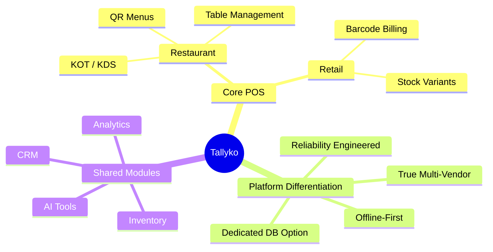

# Product Overview: Tallyko

## 1. Introduction

**Tallyko** is a next-generation, all-in-one POS (Point of Sale) and business management platform designed to serve both restaurants (including cafés and cloud kitchens) and retail businesses (grocery, pharmacy, clothing, etc.). 

We are building Tallyko to directly compete with and surpass existing solutions like Shopto. While Shopto offers a broad feature set, real user feedback highlights critical weaknesses: trust issues around pricing, multi-day outages, and severe performance regressions after updates. Tallyko addresses these flaws structurally while introducing a highly scalable, true multi-vendor architecture and a significantly refined user experience.

## 2. Core Feature Parity (The Baseline)

Tallyko will match Shopto's core capabilities from day one:

**Restaurant-side:**
*   POS billing with GST, handling dine-in, takeaway, and delivery orders.
*   Auto-generation of Kitchen Order Tickets (KOT) and a comprehensive Kitchen Display System (KDS).
*   QR-code digital menus for customer self-ordering.
*   Table management, reservations, open orders, and split bill functionality.
*   A commission-free online ordering website unique to each business.

**Retail-side:**
*   Barcode and SKU billing, stock variant management, and one-tap checkout.
*   Flexibility to handle grocery, supermarket, pharmacy, clothing, mobile/electronics, salons, and kirana stores.

**Shared Modules:**
*   **Inventory Management:** Unlimited products, real-time stock tracking, low-stock alerts, supplier/purchase entries, and wastage tracking.
*   **Billing:** Comprehensive GST billing, invoicing, and automated tax reporting.
*   **Analytics:** Detailed daily/weekly/monthly sales, best-sellers, staff/shift performance, and wastage reports.
*   **AI-Assisted Operations:** Generating menu/product listings from uploaded PDFs or images.
*   **CRM & Loyalty:** Auto-saved customer records, order history, in-app calling, and offers/loyalty campaigns.
*   **Hardware Support:** Compatibility with Bluetooth thermal printers (2" and 3").
*   **Cross-Platform Access:** A mobile app (Android & iOS) plus a web dashboard.

## 3. How We Differ (The Tallyko Advantage)

Tallyko isn't just about matching features; it's about fundamentally superior engineering and user experience. 

### A. True Multi-Vendor SaaS Architecture
Unlike single-business-per-install models, Tallyko is built as a multi-tenant SaaS platform from day one. 
*   **Tenant Isolation:** Each vendor gets an isolated workspace (products, staff, tables, reports).
*   **Database Flexibility:** By default, tenants share a central database with strict schema/row-level isolation. However, vendors can opt for a **dedicated, vendor-hosted database instance**—a key differentiator providing enterprise-grade control and compliance that competitors lack.

### B. Reliability by Design
Shopto users have suffered from multi-day outages and broken updates. Tallyko treats reliability as a first-class feature:
*   **Offline-First POS:** Billing continues to work seamlessly without internet connectivity, syncing automatically when restored.
*   **Engineered Resilience:** Mandatory health checks, graceful service degradation, and automated rollback procedures are embedded into the deployment pipeline to ensure maximum uptime.
*   **Staged Rollouts:** Updates are deployed gradually, with versioned API contracts, ensuring new releases never break existing clients.

### C. Guided, Frictionless UX
Tallyko prioritizes a clean, intuitive interface designed to reduce cognitive load.
*   **Fewer Taps:** Streamlined workflows for common actions like billing, adding stock, and generating KOTs.
*   **In-App Onboarding:** Clear visual hierarchies and contextual tooltips replace the need for external tutorial videos. Tallyko should feel noticeably easier to learn than any competitor.

### D. Advanced Layered Features
We go beyond basic functionality to offer advanced, value-added tools:
*   **Predictive Operations:** Smart low-stock alerts based on usage trends (not just static thresholds) and AI-driven pricing suggestions.
*   **Unified Owner Dashboard:** Business owners can manage multiple branches/outlets from a single, unified view.
*   **One-Tap Combos:** Effortless creation of promotional offers and combinations.

## 4. Initial Target Market
Tallyko is a drop-in replacement tailored equally for:
1.  **Restaurants / Food Service:** Fine dining, cafés, QSRs, cloud kitchens.
2.  **Retail / Commerce:** Grocery stores, pharmacies, clothing boutiques, electronics shops, and local kirana stores.

---

