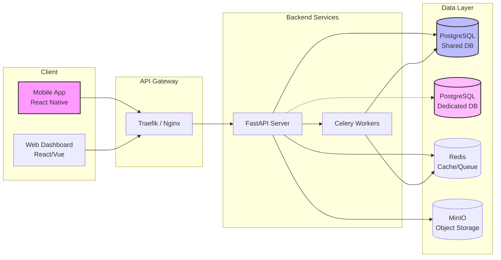

# Tech Stack & Justification

## 1. Core Principles & Constraints

The technology stack for Tallyko is strictly governed by the following constraints:
1.  **Cross-Platform Mobile:** A single codebase must output native apps for both Android and iOS.
2.  **Backend:** Must be Python-based.
3.  **Infrastructure:** Everything runs in Docker via Docker Compose (no manual local installs).
4.  **Open Source Only:** 100% free/open-source tooling through dev and deployment. No proprietary, vendor-locked BaaS (e.g., Firebase).
5.  **Multi-Tenant Architecture:** The stack must support a shared DB with schema/row isolation, and dynamic routing to dedicated vendor databases.
6.  **Observability:** Mandatory use of `tracenest` for logging across all services.

## 2. Selected Technologies

### A. Frontend / Mobile App
*   **Framework:** **React Native** (or **Flutter**) 
    *   *Justification:* Both are robust open-source frameworks that compile to Android and iOS from a single codebase. Given the offline-first requirement, React Native with WatermelonDB or Flutter with Isar/Drift are strong combinations. (Assumed: React Native for broad ecosystem support).
*   **Local Storage (Offline-First):** **WatermelonDB** (if React Native) or **SQLite/Isar** (if Flutter).
    *   *Justification:* Highly optimized for offline-first data synchronization, capable of handling complex relational data on the device and syncing efficiently to the backend.

### B. Backend API
*   **Framework:** **FastAPI** (Python)
    *   *Justification:* Highly performant, async-native, and provides automatic OpenAPI (Swagger) documentation. It is the modern standard for Python APIs and handles the high concurrency required for multi-tenant SaaS environments exceptionally well.
*   **App Server:** **Uvicorn / Gunicorn**
    *   *Justification:* Standard, production-grade ASGI servers for running FastAPI applications inside Docker.

### C. Database Layer
*   **Relational Database:** **PostgreSQL**
    *   *Justification:* The gold standard for open-source relational databases. It natively supports Row-Level Security (RLS) and schema isolation, which are critical for our multi-tenant architecture. It also robustly handles JSONb for flexible metadata.
*   **Migration Tool:** **Alembic**
    *   *Justification:* The standard migration tool for SQLAlchemy/Python, easily containerized and executed in CI/CD pipelines.

### D. Caching & Background Processing
*   **In-Memory Cache & Message Broker:** **Redis**
    *   *Justification:* Fast, open-source, and perfect for session management, rate limiting, and acting as the message broker for background tasks.
*   **Task Queue:** **Celery** (with Redis) or **ARQ** (Async Redis Queue)
    *   *Justification:* Handles heavy background jobs (e.g., AI menu processing, report generation, email sending) asynchronously without blocking the main API threads.

### E. File & Object Storage
*   **Storage Server:** **MinIO**
    *   *Justification:* An open-source, S3-compatible object storage server that can be self-hosted. Perfect for storing user uploads, AI-processed PDFs, product images, and digital receipts without paying AWS/GCP fees.

### F. Security & Auth
*   **Token Storage:** **Expo SecureStore**
    *   *Justification:* Provides encrypted, native secure storage (Keychain on iOS, Keystore on Android) to safely hold JWT Access and Refresh tokens instead of plaintext `AsyncStorage`.
*   **Security Auditing:** **pip-audit & npm audit**
    *   *Justification:* Integrated directly into the GitHub Actions CI pipeline to proactively scan dependency trees for known vulnerabilities before merging PRs.

### G. AI & Processing
*   **OCR Engine:** **Tesseract OCR (pytesseract)**
    *   *Justification:* Fully open-source and free vision engine used to parse menu images directly on the backend without relying on paid, proprietary APIs like OpenAI.

### H. Infrastructure & Deployment
*   **Containerization:** **Docker & Docker Compose**
    *   *Justification:* Ensures consistency across environments. Every dependency runs in isolation.
*   **Reverse Proxy / API Gateway:** **Traefik** or **Nginx**
    *   *Justification:* Traefik provides dynamic routing and automatic SSL (Let's Encrypt), crucial for routing traffic to dedicated vendor DB instances or specific tenant domains seamlessly.

### I. Observability & Monitoring
*   **Logging:** **tracenest** (Python Package)
    *   *Justification:* Mandated by requirements. Tracenest will be integrated into FastAPI middleware and Celery workers to emit structured logs.
*   **Log Aggregation (Assumed):** **Grafana Loki + Promtail** (or ELK stack)
    *   *Justification:* Open-source stack to ingest the logs emitted by tracenest for centralized searching and dashboarding.

## 3. Technology Flow Summary

