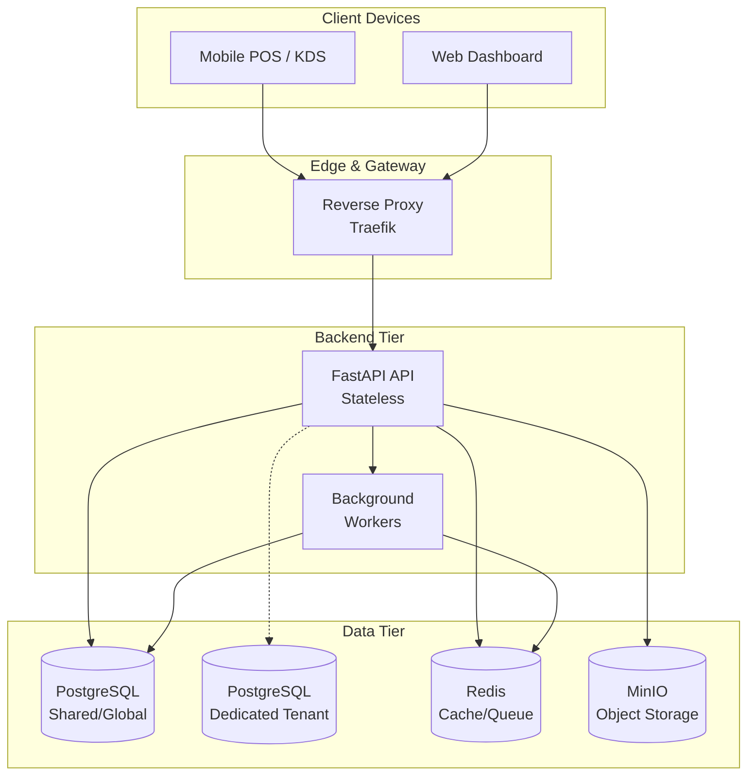

# System Architecture

## 1. High-Level Overview

Tallyko's architecture is designed to handle thousands of concurrent vendors, ensuring data isolation, offline resilience, and robust failovers. The entire ecosystem is containerized via Docker and orchestrated via Docker Compose, adhering to a 100% open-source philosophy.

The system is composed of four main tiers:
1.  **Client Tier:** Mobile apps (Android/iOS) and Web Dashboards.
2.  **Edge / Routing Tier:** Reverse proxy handling SSL termination and dynamic tenant routing.
3.  **Application Tier:** Stateless FastAPI instances and background workers.
4.  **Data Tier:** Highly available PostgreSQL, Redis, and MinIO storage.

## 2. Core Components

### A. The Edge (Reverse Proxy)
All incoming traffic hits an API Gateway/Reverse Proxy (e.g., Traefik). 
*   **Responsibilities:** SSL termination, load balancing across FastAPI replicas, and resolving tenant domains.
*   **Routing Logic:** Inspects the request (headers, subdomains, or JWT tokens) to determine the tenant context before passing it to the backend.

### B. Application Services (FastAPI)
The core logic resides in Python/FastAPI. The API is stateless, meaning any instance can handle any request.
*   **Tenant Resolution Middleware:** Every request passes through middleware that extracts the tenant ID and configures the database session to point to the correct data silo (either the shared DB or a dedicated DB string).
*   **Sync Engine:** Specialized endpoints handle offline-first sync payloads coming from the mobile clients, resolving conflicts using timestamp/version-based logic.

### C. Background Workers
Heavy tasks are offloaded to asynchronous workers (Celery/ARQ) via Redis.
*   **Tasks include:** Sending bulk CRM emails/SMS, generating heavy PDF reports, processing AI menu uploads, and aggregating analytics.

### D. Security & Stability Layers
*   **Rate Limiting:** A Redis-backed sliding-window rate limiter protects public and authenticated endpoints against brute-force and DoS attacks (e.g., locking `/auth/login` to 10 req/min).
*   **Global Exception Boundaries:** Top-level handlers automatically intercept `HTTPException` and validation errors to ensure pure, schema-compliant JSON is returned instead of stack traces.
*   **Test-Environment Isolation:** During automated testing (`pytest`), the database dependency injector dynamically downgrades from `AsyncEngine` pooling to a `NullPool` to guarantee strictly isolated, crosstalk-free connections across asynchronous test event loops.

### E. Data Stores
*   **Central Postgres:** Houses the global directory (users, tenant mapping, billing contracts) and the shared tenant data.
*   **Dedicated Postgres:** Isolated instances running for specific high-value vendors.
*   **Redis:** Caches frequently accessed data, manages API sliding-window rate limits, and queues background jobs.
*   **MinIO:** Stores static assets, product images, and receipt PDFs.

## 3. Global Architecture Diagram

*(Note: Diagram converted to standard flowchart for broad rendering compatibility).*

## 4. Scalability & Reliability Highlights
*   **Stateless APIs:** FastAPI containers can be scaled horizontally behind the proxy during peak restaurant hours.
*   **Connection Pooling:** PgBouncer (or equivalent) will be deployed in front of PostgreSQL to manage the high volume of connections from scaled API instances.
*   **Health Checks:** Docker Compose will enforce rigorous health checks. The proxy routes traffic only to healthy API containers.
*   **Observability:** Every service (API, Workers) is instrumented with `tracenest` to emit structured JSON logs to standard output, collected by the logging driver.
