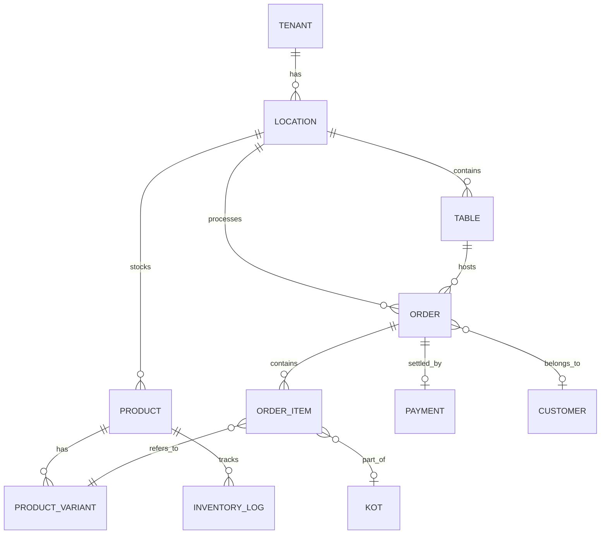

# Data Model & Schema Strategy

## 1. Schema Philosophy

Tallyko's data model must handle the complexity of both retail (grocery, apparel with variants) and restaurant (tables, KOTs, menus) domains seamlessly. 

The strategy utilizes strict relational modeling for core business logic, combined with `JSONB` columns in PostgreSQL to handle domain-specific flexibility without schema bloat.

## 2. Global Schema (Management DB)

This database houses non-tenant data and manages the SaaS lifecycle.

*   `vendors`: The root business entity.
*   `tenant_configs`: Maps a vendor to their database connection string (Shared vs Dedicated) and feature flags.
*   `subscriptions`: Immutable contracts defining what the vendor has paid for. *Crucial for resolving the "Shopto lifetime plan" trust issue.* Plan entitlements are versioned and immutable.
*   `global_users`: Authentication credentials. Users map to vendors via a junction table (a user could theoretically manage multiple vendors).

## 3. Tenant Schema (Shared or Dedicated DB)

This schema is identical whether it resides in the shared pool or a dedicated instance. In the shared pool, *every* table includes a `tenant_id` column protected by RLS (Row-Level Security).

### Core Entities

*   **`locations` (Branches):** A vendor can have multiple physical stores. All subsequent entities tie back to a location.
*   **`users` (Staff):** Roles and permissions (Admin, Cashier, Waiter, Kitchen).

### Catalog & Inventory

*   **`categories`:** Grouping products.
*   **`products`:** The core item.
    *   *Retail usage:* Barcode, SKU, generic name.
    *   *Restaurant usage:* Menu item name.
*   **`product_variants`:** Handles complexity like "Size: Large, Color: Red" (Retail) or "Size: Half/Full" (Restaurant).
*   **`inventory_logs`:** Append-only ledger of stock changes (additions, sales, wastage). This ensures auditable real-time stock levels.

### Ordering & Billing

*   **`orders`:** The main transaction record. Type: `DINE_IN`, `TAKEAWAY`, `DELIVERY`, `RETAIL_WALKIN`.
*   **`order_items`:** Line items tying a product/variant to an order, along with applied taxes and discounts.
*   **`payments`:** Tracks how an order was settled (Cash, Card, UPI, Split).
*   **`taxes`:** GST configurations linked to products.

### Restaurant Specifics

*   **`tables`:** Physical tables mapped to a location.
*   **`kots` (Kitchen Order Tickets):** Tracks the lifecycle of food preparation. Linked to `order_items`. Statuses: `PRINTED`, `PREPARING`, `READY`.

### Customers (CRM)

*   **`customers`:** Saved profiles for loyalty and CRM.

## 4. Immutable Entitlement Pattern

To address the trust issue highlighted in competitor reviews, we use an immutable ledger for billing.

When a user purchases a plan, a snapshot of what that plan entails (e.g., `{"max_locations": 3, "kds_enabled": true}`) is serialized into a `JSONB` column on their `subscriptions` record. 
If Tallyko changes pricing or limits in the future, it only updates the master template. Existing vendors strictly read from their immutable snapshot until they explicitly upgrade or renew.

## 5. ER Diagram (Simplified Tenant Schema)

