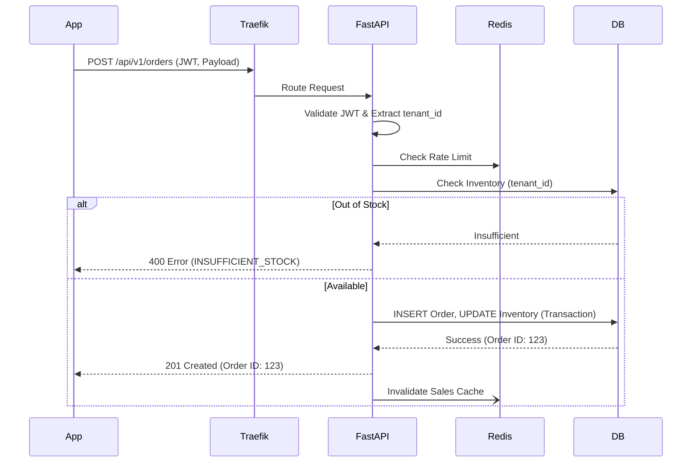

# API Design & Contract Strategy

## 1. RESTful Philosophy

Tallyko's backend exposes a RESTful JSON API via FastAPI. The API is the sole entry point for the Mobile App, Web Dashboard, and third-party integrations.

*   **Format:** Standard JSON for request and response bodies.
*   **Documentation:** Auto-generated OpenAPI (Swagger) provided out-of-the-box by FastAPI.
*   **Stateless:** Every request must contain all necessary authentication state (JWT).

## 2. Versioned API Contracts

To solve the "performance regressions after updates" flaw seen in competitors, Tallyko enforces strict API versioning. Mobile apps might not update immediately, so the backend must support older API contracts.

*   **URL Pattern:** `/api/v1/...`, `/api/v2/...`
*   **Deprecation Policy:** Endpoints are never modified in a breaking way. If the response shape must change, a new endpoint or version is created. Old versions are supported for a minimum of 180 days.

## 3. Standard Response Shapes

To ensure predictability for the client side, all API responses adhere to a unified wrapper structure.

**Success (200/201):**
```json
{
  "success": true,
  "data": { ... },
  "meta": {
    "page": 1,
    "total": 50,
    "timestamp": "2023-10-27T10:00:00Z"
  }
}
```

**Error (4xx/5xx):**
```json
{
  "success": false,
  "error": {
    "code": "INSUFFICIENT_STOCK",
    "message": "Item X is out of stock.",
    "details": {}
  }
}
```

## 4. Authentication & Authorization

*   **Auth Type:** Bearer Token (JWT).
*   **Payload:** Contains `user_id`, `tenant_id`, and `role`.
*   **Validation:** FastAPI Dependency Injection validates the token on every protected route. If the token is valid, it injects the `tenant_id` into the request context for database routing (as detailed in `03_Multi_Vendor_Architecture.md`).

## 5. Offline-First Sync Endpoints

Because POS systems must work offline, standard CRUD endpoints are supplemented by specialized synchronization endpoints.

*   **`POST /api/v1/sync/pull`**: The client sends its last sync timestamp. The server returns all records (Products, Orders, Customers) updated since that time.
*   **`POST /api/v1/sync/push`**: The client sends a batch of locally created/modified records (e.g., queued offline orders). The server processes them, resolves conflicts, and confirms persistence.

*(More detail on this logic in `07_Offline_Sync_Strategy.md`)*

## 6. Rate Limiting and Caching

*   **Rate Limiting:** Implemented via Redis to prevent abusive traffic from a single tenant from degrading the shared infrastructure.
*   **Caching:** Read-heavy endpoints (like the customer-facing QR Menu `/api/v1/menus/{id}`) cache their JSON responses in Redis. The cache is invalidated when a vendor updates their menu in the dashboard.

## 7. Example Sequence: Placing an Order


