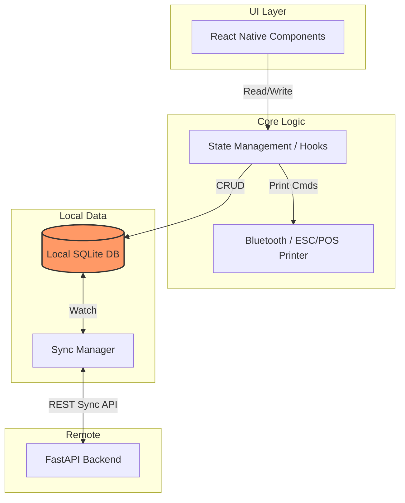

# Mobile App Architecture

## 1. Single Codebase Strategy

Tallyko requires a mobile application that runs on both Android and iOS from a single shared codebase to maximize development velocity and ensure feature parity across devices.

*   **Framework:** **React Native** (or Flutter). 
*   **Target Devices:** Android Phones, Android Tablets (KDS/POS terminals), iPhones, and iPads. The UI must be fully responsive.
*   **UX Philosophy:** Minimal taps, guided workflows, and clear visual hierarchy. It must be demonstrably easier to train staff on Tallyko than on competitors.

## 2. The Offline-First Imperative

A POS system cannot stop working if the Wi-Fi drops. The app is architected with a robust local-first strategy.

*   **Local Database:** WatermelonDB (React Native) or SQLite (Flutter).
*   **Architecture Pattern:** The UI *only* ever reads from and writes to the local database. It never blocks waiting for a network request to save an order.
*   **Background Sync:** A background worker constantly monitors the local DB for changes and pushes them to the backend API (`/api/v1/sync/push`). It also polls the backend (`/api/v1/sync/pull`) for updates made by other devices.

## 3. State Management & Data Flow

1.  **User Action:** Cashier taps "Pay" on an order.
2.  **Local Write:** The app immediately saves the order as `status: 'completed', sync_status: 'pending'` in the local SQLite database.
3.  **Instant Feedback:** The UI immediately updates and prints the receipt (via Bluetooth).
4.  **Async Sync:** The sync manager detects the `pending` record and attempts to push it to the FastAPI backend.
5.  **Confirmation:** Upon 200 OK from the server, the local record updates to `sync_status: 'synced'`.

## 4. Hardware Integrations

Interacting with hardware is a core requirement for a POS system.

*   **Bluetooth Thermal Printers (2" / 3"):** 
    *   The app uses native modules to discover and pair with ESC/POS compatible thermal printers.
    *   Receipt generation involves converting order data into raw ESC/POS byte commands locally on the device (no cloud rendering required), ensuring instant offline printing.
*   **Barcode Scanners:**
    *   **Camera:** Built-in vision libraries for scanning QR menus or SKUs using the device camera.
    *   **External USB/Bluetooth Scanners:** The app must support HID (Human Interface Device) keyboard inputs, listening for rapid keystrokes followed by a carriage return to auto-add items to the cart.

## 5. Module Structure

The codebase is organized by domain to allow clear separation of concerns between retail and restaurant workflows.

```text
/src
  /core            (Auth, Sync Engine, Local DB Setup, Hardware/Bluetooth)
  /ui              (Shared components: Buttons, Typography, Layouts)
  /modules
    /restaurant    (Tables, KDS, KOT logic)
    /retail        (Barcode scanner logic, quick checkout)
    /shared        (Billing, Inventory, CRM, Settings)
  /services        (API clients)
```

## 6. Architecture Diagram


