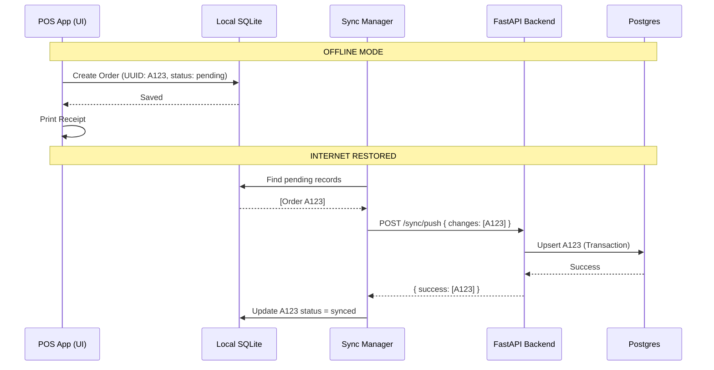

# Offline Sync Strategy

## 1. The Offline-First Requirement

A critical failure point of many cloud-based POS systems, including Shopto, is their inability to function during internet outages. Tallyko is engineered as an **offline-first** application. 

The Mobile POS app must be capable of completing end-to-end billing workflows, updating local inventory, generating KOTs, and printing receipts without an active internet connection.

## 2. Sync Architecture

Tallyko uses an asynchronous, bi-directional sync strategy based on logical timestamps.

1.  **Local Database:** All reads and writes by the POS UI are performed against a local SQLite database.
2.  **Tracking Changes:** Every table in the local and remote databases includes the following metadata columns:
    *   `id` (UUID - generated client-side to avoid ID collisions)
    *   `updated_at` (Timestamp)
    *   `deleted_at` (Timestamp - for soft deletes)
3.  **The Sync Engine:** A background process in the mobile app manages communication with the backend.

## 3. Pull Process (Server to Client)

The app periodically fetches data updated on the server by other devices (e.g., a menu change made on the Web Dashboard).

1.  **Request:** App sends `POST /api/v1/sync/pull` containing the `last_pulled_at` timestamp stored locally.
2.  **Server Action:** Backend queries the DB for all records where `updated_at > last_pulled_at` (filtered by the user's `tenant_id`).
3.  **Response:** Server returns the batch of updated records.
4.  **Client Merge:** The local sync engine upserts these records into the SQLite database and updates its `last_pulled_at` watermark.

## 4. Push Process (Client to Server)

When the app creates an order while offline, it must eventually reach the server.

1.  **Local Queue:** Every time a record is mutated locally, its `sync_status` flag is set to `pending`.
2.  **Request:** When internet is available, the app sends `POST /api/v1/sync/push` containing all `pending` records.
3.  **Server Action:** The backend processes the batch within a database transaction.
4.  **Conflict Resolution:**
    *   *Last Write Wins (Default):* If a record was updated both locally and on the server, the one with the most recent `updated_at` timestamp prevails.
    *   *Additive Merging (Inventory):* For stock levels, instead of overwriting a total value, the server applies the differential (e.g., `-2 items sold` from the inventory log) to prevent race conditions.
5.  **Response:** Server returns a list of successfully processed UUIDs.
6.  **Client Cleanup:** The app updates the local `sync_status` to `synced` for those UUIDs.

## 5. Handling KDS (Kitchen Display System) Offline

A unique challenge in restaurants is that POS devices must communicate with Kitchen Display System (KDS) tablets even when the internet is down.

*   **Local Network Fallback (Assumed Strategy):** If the external internet is down, POS devices will attempt to discover KDS devices on the same local Wi-Fi network (LAN) using zero-configuration networking (e.g., mDNS/Bonjour). 
*   **Direct Payload:** KOTs are sent directly over the LAN via a lightweight local socket connection, ensuring the kitchen keeps running seamlessly.

## 6. Sync Flow Diagram

