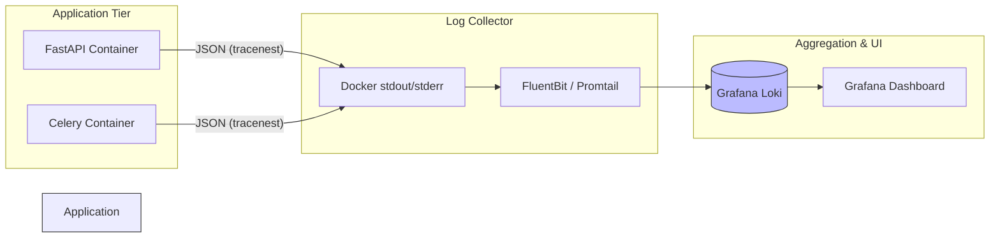

# Logging & Observability

## 1. Tracenest Mandate

As per the hard constraints, **every service must use `tracenest`** (`https://pypi.org/project/tracenest/`) for logging. Standard `print()` statements or unformatted Python `logging` module usage is strictly prohibited in production code.

Tracenest provides structured JSON logging, which is essential for searching and filtering logs in a multi-tenant environment where distinguishing between different vendors' requests is critical.

## 2. Integration Points

### A. FastAPI Middleware Integration
A custom middleware wraps every incoming HTTP request.
*   **Request Start:** Generates a unique `trace_id`. Extracts `tenant_id` and `user_id` from the JWT token (if present).
*   **Contextual Logging:** Binds these variables to the tracenest context. Any subsequent log emitted during that request lifecycle will automatically include the `trace_id`, `tenant_id`, and `user_id`.
*   **Request End:** Logs the HTTP status code, request path, and execution duration.

### B. Background Worker Integration (Celery/ARQ)
*   When the API queues a job, it passes the `trace_id` and `tenant_id` into the task arguments.
*   The worker initializes tracenest with these context variables before executing the job, ensuring logs can be traced from the API request right through to the asynchronous background completion.

### C. Error Handling
Global exception handlers in FastAPI catch unhandled exceptions, log the stack trace via tracenest at the `ERROR` or `CRITICAL` level, and return a standardized JSON error response to the client.

## 3. Log Output and Aggregation

### Where do the logs land?
1.  **Application Output:** Tracenest is configured to output structured JSON strings to `stdout` and `stderr`.
2.  **Docker Collection:** Docker's logging daemon captures this standard output.
3.  **Log Aggregation (The Stack):**
    *   In the Docker Compose stack, a log collection agent (e.g., **Promtail** or **Fluent Bit**) mounts the Docker socket or log directories.
    *   It parses the JSON logs and forwards them to an open-source aggregator (e.g., **Grafana Loki**).
    *   Developers use **Grafana** to visualize, query, and alert on these logs.

## 4. Querying Logs (Example)

Because logs are structured JSON via tracenest, developers investigating an issue for a specific vendor can write precise queries in Grafana Loki:

```text
{container="api"} | json | tenant_id="tnt_59482" level="error"
```
This instantly returns all errors experienced by that specific tenant, regardless of which API replica served the request.

## 5. Observability Data Flow


