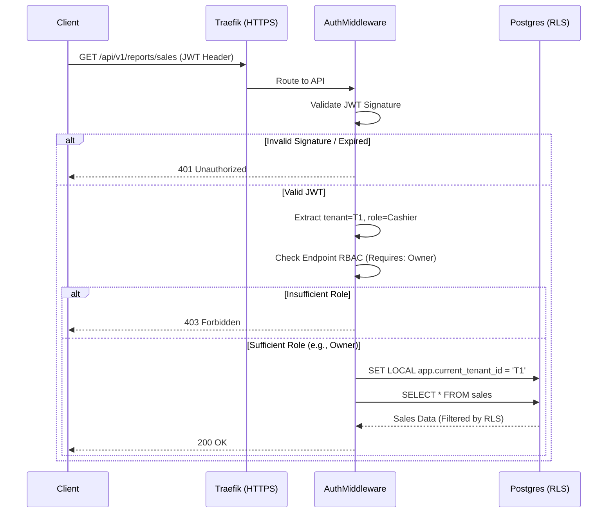

# Security & Authentication

## 1. Multi-Tenant Data Security (Zero Cross-Talk)

The most critical security requirement in a multi-vendor SaaS platform is ensuring one tenant cannot access another tenant's data.

Tallyko enforces this at two distinct layers:
1.  **Application Layer:** The API middleware extracts the `tenant_id` from the authenticated user's JWT and injects it into every database query's `WHERE` clause.
2.  **Database Layer (PostgreSQL RLS):** As a fail-safe against application bugs, Row-Level Security (RLS) is enabled on all shared tables. The application sets the database session variable (`app.current_tenant_id`). If an API route accidentally omits the `WHERE tenant_id = X` clause, the database itself will silently filter out rows belonging to other tenants.

## 2. Authentication Flow

Authentication utilizes stateless JSON Web Tokens (JWT).

1.  **Login:** User submits credentials (email/phone and password) to `/api/v1/auth/login`.
2.  **Verification:** Backend hashes the password (using Argon2 or bcrypt) and checks it against the Global Database.
3.  **Token Issuance:** Backend signs a JWT with a short expiration (e.g., 1 hour).
    *   **Payload structure:**
        ```json
        {
          "sub": "user_123",
          "tenant_id": "tnt_889",
          "role": "admin",
          "exp": 1698408000
        }
        ```
4.  **Refresh Tokens:** A long-lived refresh token is stored securely via **Expo SecureStore** on mobile devices, leveraging the native hardware keystore (Keychain on iOS, Keystore on Android). When the short-lived JWT expires, the `api.js` Axios interceptor automatically catches the `401 Unauthorized` response, uses the refresh token to obtain a new access token, and retries the request seamlessly.

## 2.5 API Hardening & Abuse Prevention

*   **Rate Limiting:** A Redis-backed sliding-window rate limiter protects endpoints from brute force and DoS attacks. For example, `/auth/login` is strictly limited to 10 requests per minute per IP address.
*   **Global Exception Boundaries:** Top-level handlers in `main.py` intercept unhandled `HTTPException` and `RequestValidationError` errors. This prevents 500 stack traces from leaking server internals to the client, enforcing a strict `{"success": false, "message": "..."}` JSON schema.
## 3. Role-Based Access Control (RBAC)

Within a single tenant, different staff members have different permissions.

*   **Roles:** `Owner`, `Manager`, `Cashier`, `Kitchen_Staff`.
*   **Enforcement:** FastAPI dependency injection checks the `role` encoded in the JWT against the required permissions for the endpoint.
    *   *Example:* Only `Owner` or `Manager` can access `DELETE /api/v1/products/{id}`. `Cashier` receives a `403 Forbidden`.

## 4. Hardware and Network Security

*   **Encryption in Transit:** Traefik forces all incoming connections over HTTPS (TLS 1.2+). Unencrypted HTTP traffic is rejected or redirected.
*   **Database Access:** PostgreSQL and Redis containers do not expose ports to the public internet. They are only accessible via the internal Docker network.

## 5. Security Sequence Diagram (Request Lifecycle)


