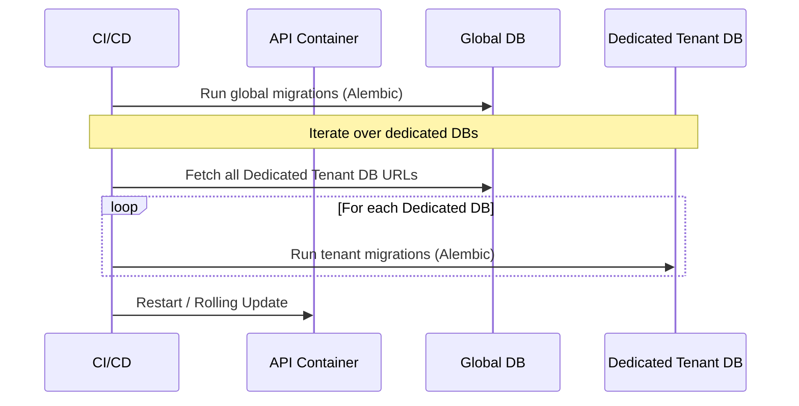

# Environments & Configuration

## 1. Environment Segregation

Tallyko maintains strict separation between environments to ensure that development and testing activities never impact production data or stability.

We define three primary environments:
1.  **Local (Development):** Running on a developer's machine using `docker-compose.yml`.
2.  **Staging:** An exact replica of the production infrastructure, but with anonymized or synthetic data. Used for final QA before release.
3.  **Production:** The live multi-tenant system serving actual vendors.

## 2. Environment Variables (.env)

Configuration is entirely injected via environment variables, following Twelve-Factor App methodology. Code is never environment-aware (e.g., no `if IS_PROD:` logic scattered throughout the codebase).

### Key Variables
*   `ENVIRONMENT`: Identifies the current tier (`development`, `staging`, `production`).
*   `DATABASE_URL`: Connection string for the Global/Shared DB.
*   `REDIS_URL`: Connection string for the cache.
*   `JWT_SECRET`: Cryptographic key used to sign and verify tokens.
*   `MINIO_ENDPOINT` / `MINIO_ACCESS_KEY`: Object storage credentials.

## 3. Configuration Management

*   **Local:** Developers maintain their own `.env` files (ignored by Git).
*   **Staging/Production:** Secrets are injected at runtime by the CI/CD pipeline or managed via a secure vault (e.g., Docker Secrets, GitHub Actions Secrets, or HashiCorp Vault if scaling up).

## 4. Database Migrations Across Environments

Database schema changes (Migrations) are managed via Alembic (Python).

*   **Rule 1:** A migration script must be created for *every* database change. No manual SQL execution in production.
*   **Rule 2:** Migrations run automatically during the CD pipeline deployment phase.
*   **Rule 3:** The app must be compatible with the database *before and after* the migration to support zero-downtime rolling deployments. This means avoiding `DROP COLUMN` commands; instead, deprecate the column in code first, then drop it in a subsequent release weeks later.

## 5. Multi-Tenant DB Environment Flow

