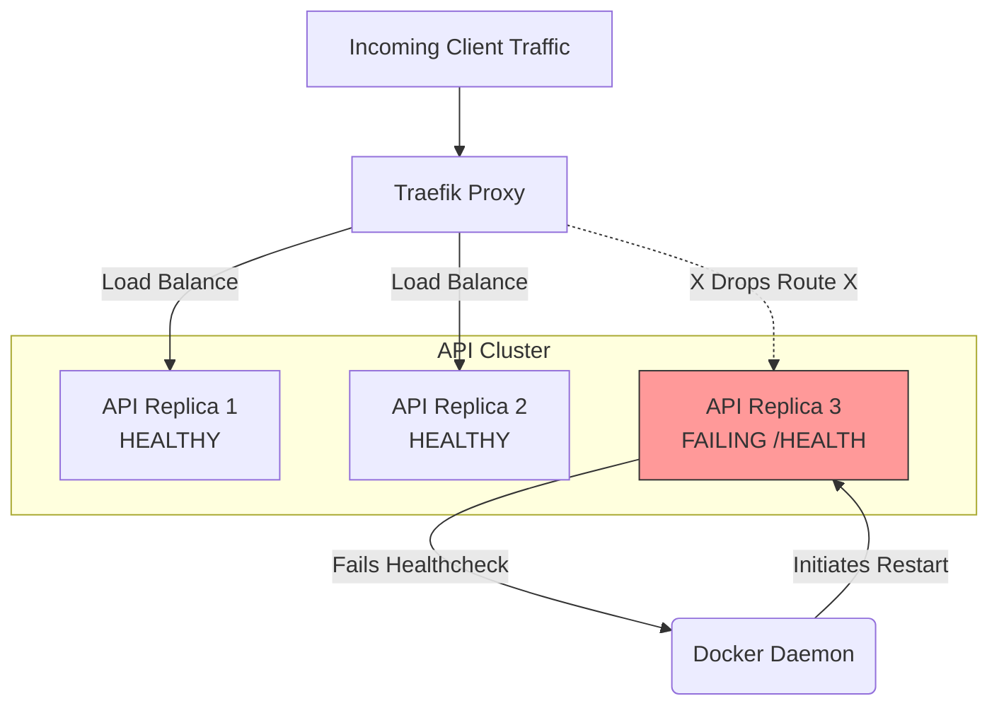

# Reliability & Rollback Strategy

## 1. Addressing the Competitor Weakness

Shopto reviews frequently cite multi-day outages and broken functionality following updates. Tallyko is engineered specifically to prevent this class of failure. Reliability is a hard constraint, not an afterthought.

## 2. Health Checks & Self-Healing

Every service defined in `docker-compose.yml` includes rigorous health checks.

*   **FastAPI:** Exposes a `/health` endpoint that checks not just API responsiveness, but also verifies connectivity to Postgres and Redis.
*   **Docker Daemon:** If a container fails its health check (e.g., API returns 500, or PostgreSQL connection drops), Docker automatically restarts the container.
*   **Traefik Routing:** The reverse proxy automatically removes unhealthy API containers from its load-balancing pool, ensuring users are not routed to a broken instance.

## 3. Graceful Degradation

If a non-critical subsystem fails, the core POS billing flow must survive.

*   *Example 1 (AI Processing Down):* If the Celery workers processing AI menu uploads crash, the user receives an alert: "AI Menu Upload currently delayed," but manual POS billing continues flawlessly.
*   *Example 2 (Analytics DB Slow):* If a complex analytical query times out, it should not lock the main database. Queries are subjected to strict timeouts, and read-heavy analytics will eventually be routed to a read-replica database to protect the primary transactional database.
*   *Example 3 (Internet Outage):* Handled by the offline-first architecture (`07_Offline_Sync_Strategy.md`).

## 4. Rollback Procedure

If a deployment introduces a critical bug that bypasses the canary rollout phase, an immediate rollback is required.

1.  **Code Rollback:** The CI/CD pipeline maintains previously built Docker images tagged by commit hash. Reverting is as simple as updating the deploy script to target the previous hash (e.g., `docker service update --image api:old_hash`). This takes seconds.
2.  **Database Rollback (The Hard Part):** 
    *   Rolling back code is easy; rolling back a database schema is dangerous.
    *   **Strategy:** We employ *forward-only, non-destructive migrations*. We never drop a column or table in the same release that removes the application code using it. If a rollback occurs, the older application code will still find the columns it expects in the database.

## 5. Reliability Flow Diagram

