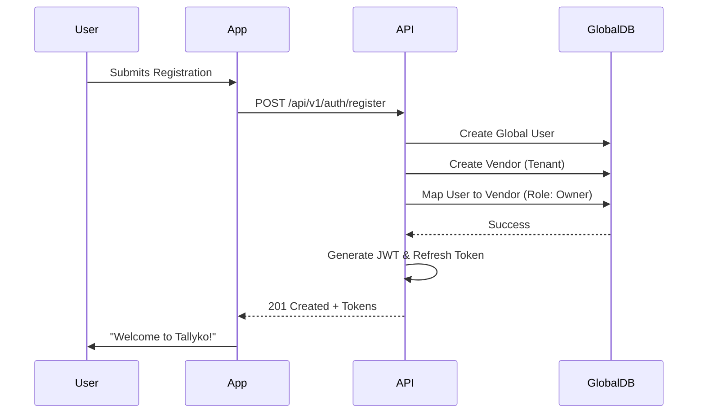

# Auth & Tenant Setup

## Section 1 — For the Customer / Business Owner

### What is this?
This is the front door to Tallyko. When you first download the app or visit the website, this feature allows you to create your business account (your "Tenant" space) and log in securely. 

### Why does it exist?
Unlike single-outlet POS apps that mix everything together, Tallyko is built so that every business gets its own secure, isolated vault. This feature ensures that only you and your authorized staff can access your menu, sales, and customer data. It also allows an owner with five different restaurant branches to manage all of them under one single login, without having to remember five different passwords.

### Real-World Examples
*   **A new café opens:** The owner downloads Tallyko, taps "Create Business," enters their phone number, verifies with an OTP, and their completely blank, secure POS system is ready to use in seconds.
*   **Adding a manager:** The owner goes to settings and invites their new manager via email. The manager downloads the app, creates their own password, and can immediately see the café's data, but the owner has restricted them from seeing the final profit reports.

### Edge Cases
*   *What happens if I forget my password?* You tap "Forgot Password," receive an OTP to your registered phone number or email, and reset it securely.
*   *What happens if a staff member's phone is stolen?* The owner can immediately revoke that staff member's access from the owner dashboard, instantly logging out the stolen device.

---

## Section 2 — For the Developer

### Data Model Touched
*   **Global DB:** 
    *   `vendors`: `id`, `name`, `created_at`
    *   `tenant_configs`: `vendor_id`, `db_url`, `status`
    *   `global_users`: `id`, `email`, `phone`, `password_hash`
    *   `user_vendor_roles`: `user_id`, `vendor_id`, `role` (Junction table)

### API Endpoints
*   `POST /api/v1/auth/register`: Creates global user, vendor, and tenant config.
*   `POST /api/v1/auth/login`: Validates credentials, returns JWT.
*   `POST /api/v1/auth/refresh`: Issues a new JWT using a valid refresh token.
*   `POST /api/v1/auth/invite`: (Requires `Owner` role) Sends an invite link to a new staff member.

### Request/Response Shape (Login)
**Request:**
```json
{
  "email": "owner@cafe.com",
  "password": "secure_password"
}
```
**Response (200 OK):**
```json
{
  "success": true,
  "data": {
    "token": "eyJhbGci...",
    "refresh_token": "def456...",
    "user": { "id": "U1", "role": "owner" }
  }
}
```

### Validation Rules
*   Email must be valid format.
*   Phone number must include country code.
*   Passwords must be >= 8 characters.

### Multi-Tenant Considerations
The login endpoint queries the **Global DB**. Once authenticated, the returned JWT contains the `tenant_id` (derived from the `vendor_id`). All subsequent requests from this client will use this `tenant_id` to route to the correct isolated data silo.

### Logging Events (tracenest)
*   `user_registered`: Includes `tenant_id`.
*   `login_success` / `login_failed`: Includes `user_email` and IP address.

### Engineering Complexity Rating
**Medium.** The CRUD operations are simple, but properly configuring the Global DB routing middleware and ensuring JWTs are securely handled (refresh token rotation) requires careful implementation.

### Sequence Diagram

