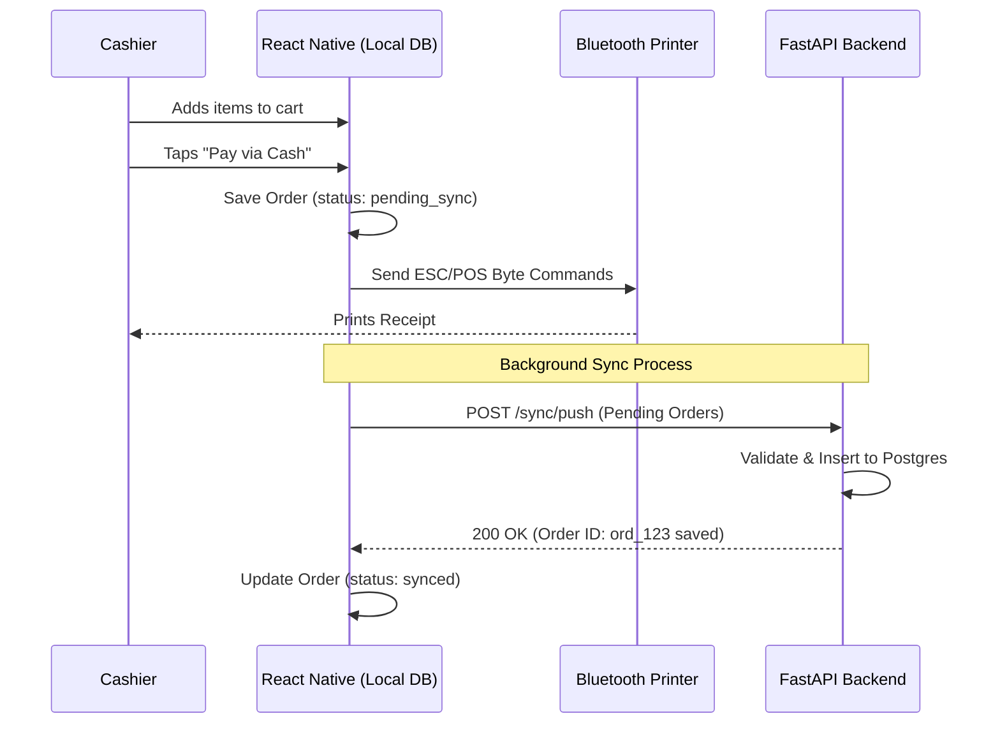

# Core POS Billing

## Section 1 — For the Customer / Business Owner

### What is this?
This is the cash register screen. It is where your staff rings up customers, adds items to a cart, applies discounts, calculates taxes (like GST), and accepts payments (Cash, Card, UPI). It automatically prints a receipt when the order is complete.

### Why does it exist?
Billing is the lifeblood of any business. We researched Shopto and competitors and found their billing screens often feel cluttered. Tallyko's billing screen is designed for pure speed. It has a massive layout for touch targets (so cashiers don't miss buttons during a rush), a lightning-fast barcode scanner mode for retail, and it works flawlessly even if your internet goes down.

### Real-World Examples
*   **The Quick Service Cafe:** A customer orders a Coffee and a Muffin. The cashier taps the two items on the screen, taps the giant green "Cash" button, enters the amount handed to them, and the receipt prints instantly. The whole process takes 3 seconds.
*   **The Retail Store:** The cashier connects a Bluetooth barcode scanner. They just scan items rapidly—*beep, beep, beep*—the cart populates automatically, applies the correct GST, and they complete the checkout.

### Edge Cases
*   *What happens if the internet drops mid-order?* Absolutely nothing changes for the cashier. They keep ringing up orders, and receipts keep printing. Tallyko saves everything locally and automatically syncs to the cloud when the internet comes back.
*   *What if a customer changes their mind about an item?* Swiping left on an item in the cart instantly removes it.

---

## Section 2 — For the Developer

### Data Model Touched (Shared Tenant DB)
*   `orders`: `id`, `tenant_id`, `type` (walk_in, dine_in), `total_amount`, `tax_amount`, `discount_amount`, `status`, `sync_status`
*   `order_items`: `id`, `order_id`, `product_id`, `quantity`, `unit_price`, `subtotal`
*   `payments`: `id`, `order_id`, `method` (CASH, CARD, UPI), `amount`

### API Endpoints
*   *(Note: Most creation happens via the Offline Sync Engine, see `07_Offline_Sync_Strategy.md`)*
*   `POST /api/v1/sync/push`: The mobile app pushes locally completed `orders`, `order_items`, and `payments` to the server.
*   `GET /api/v1/orders`: Fetch historical orders for receipt re-printing or refunds.

### Request/Response Shape (Sync Push payload for an Order)
**Request:**
```json
{
  "orders": [
    {
      "id": "ord_123",
      "total_amount": 250.00,
      "status": "completed",
      "items": [
        { "product_id": "P12", "quantity": 1, "unit_price": 150.00 },
        { "product_id": "P15", "quantity": 1, "unit_price": 100.00 }
      ],
      "payments": [
        { "method": "CASH", "amount": 250.00 }
      ]
    }
  ]
}
```

### Validation Rules
*   Total order amount must equal the sum of item subtotals plus tax minus discount.
*   Payment amounts must equal or exceed the total order amount to mark status as `completed`.
*   Product IDs must exist in the database (validated during sync).

### Multi-Tenant Considerations
Orders pushed from the client are inherently scoped to the `tenant_id` of the JWT used during the sync request.

### Logging Events (tracenest)
*   `order_synced`: Logs when a batch of offline orders successfully persists to the cloud. Includes `order_count` and `tenant_id`.

### Engineering Complexity Rating
**High.** The UI requires complex local state management (managing the cart, calculating taxes on the fly). The integration with Bluetooth ESC/POS thermal printers for local receipt generation requires native module bridging in React Native. The offline-first sync mechanism requires careful conflict resolution logic on the backend.

### Sequence Diagram (Offline-First Flow)

