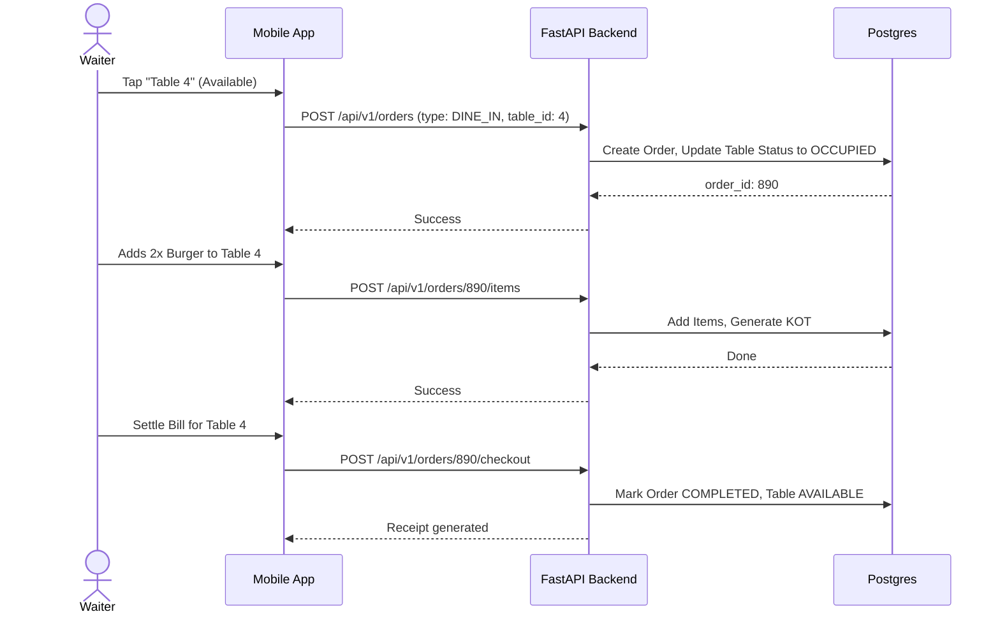

# Table Management (Restaurant POS)

## 1. Overview
The Table Management feature allows dine-in restaurants to map their physical layout digitally, assign orders to specific tables, track table occupancy status, and seamlessly manage split billing.

## 2. Key Capabilities
* **Visual Table Grid:** View all tables at a glance (Available, Occupied, Reserved).
* **Live Order Tracking:** Tap an occupied table to instantly view the ongoing bill and add new items (KOTs) to it.
* **Table Transfers:** Easily move a party from one table to another, carrying their running tab with them.
* **Split Billing:** Divide a final table bill by item, by percentage, or equally among guests.

## 3. How to Use

### A. Assigning a Table
1. From the POS dashboard, tap the **Tables** tab on the bottom navigation bar.
2. The screen displays a grid of tables. Green indicates *Available*, Red indicates *Occupied*.
3. Tap an **Available** table. You will be redirected to the Catalog screen to start adding items to their tab.
4. The system automatically creates a `DINE_IN` order linked to that specific `table_id`.

### B. Adding Items to an Existing Table
1. As the meal progresses, guests may order more items.
2. Tap the **Tables** tab and tap the **Occupied** table (marked in red).
3. The ongoing bill is displayed. Tap **+ Add Item** to return to the catalog.
4. When you checkout these new items, a new KOT (Kitchen Order Ticket) is generated for just the new items, but the master bill is updated.

### C. Clearing a Table (Checkout)
1. When the guests are ready to pay, tap their table.
2. Tap **Settle Bill**.
3. Choose the payment method (Cash/Card). Upon successful payment, the table status automatically resets to *Available* (Green).

## 4. Under the Hood (Data Flow)

When a table is occupied, the backend links a standard `Order` record to a `Table` record. The `Order` remains in a `PENDING` state until the final checkout.

