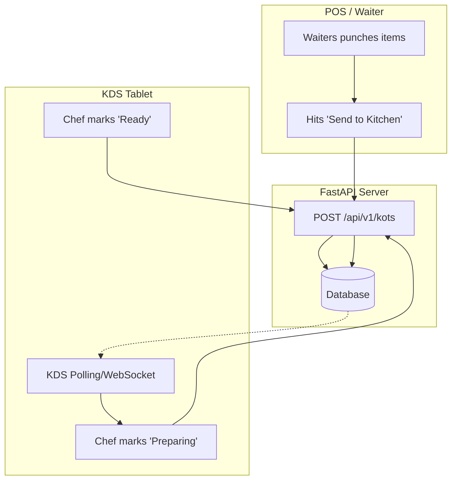

# Kitchen Display System (KDS) & KOTs

## 1. Overview
The Kitchen Display System (KDS) replaces traditional paper tickets in a restaurant kitchen. It provides a real-time, digital queue of all food orders (Kitchen Order Tickets - KOTs) currently being prepared, ensuring chefs never lose a ticket and service times are optimized.

## 2. Key Capabilities
* **Instant Ticket Routing:** The moment a waiter punches an order on the POS, it appears on the KDS tablet in the kitchen.
* **Status Tracking:** Chefs can tap tickets to mark them as `Preparing` and then `Ready`.
* **Color-Coded Timers:** Tickets change color (e.g., Green -> Yellow -> Red) based on how long they have been waiting, highlighting overdue orders.
* **Offline Resilience:** If the internet drops, POS devices use local networking (LAN) to directly push tickets to the KDS tablet.

## 3. How to Use

### A. Viewing the Queue
1. Mount a tablet in the kitchen and open Tallyko.
2. Navigate to the **Kitchen** tab on the bottom navigation bar.
3. The screen displays a Kanban-style board or a grid of active tickets.
4. Each ticket shows: Table Number (or Order ID), Time Elapsed, and the list of items to prepare (with special instructions).

### B. Managing a Ticket
1. When a chef begins cooking an order, they tap the ticket and select **Start Preparing**.
2. When the food is plated and ready for the waiter, the chef taps **Mark Ready**.
3. The ticket disappears from the active KDS queue.
4. *Optional:* A push notification or visual cue is sent back to the waiter's POS device letting them know Table 4's food is ready for pickup.

## 4. Under the Hood (Data Flow)

A single POS order might generate multiple KOTs (e.g., if a table orders starters first, and mains 30 minutes later).

