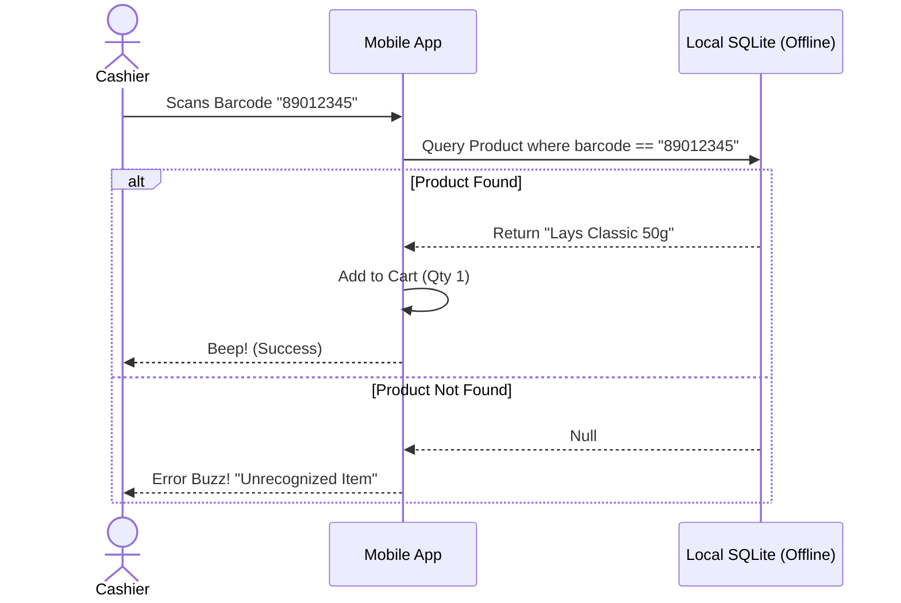

# Barcode Scanner & Retail Billing

## 1. Overview
While restaurants use visual grids for menus, retail businesses (grocery, pharmacy, apparel) rely heavily on speed and volume. The Scanner feature transforms the mobile device's camera into a high-speed barcode/QR code reader, allowing cashiers to rapidly add items to a cart.

## 2. Key Capabilities
* **Rapid Hardware/Software Scanning:** Supports the built-in device camera, or integrates seamlessly with physical Bluetooth/USB barcode guns.
* **Variant Support:** Scanning a specific barcode automatically resolves to the exact product variant (e.g., Red T-Shirt vs Blue T-Shirt).
* **Auto-Increment:** Scanning the same item twice automatically bumps the quantity to 2, rather than adding a duplicate line item.
* **Fallback Search:** If a barcode is unreadable, cashiers can quickly search by SKU or product name in the same interface.

## 3. How to Use

### A. Setting Up Barcodes (In Catalog)
1. Go to the **Catalog** tab.
2. When creating or editing a product, locate the `Barcode/SKU` field.
3. You can manually type a numeric SKU, or tap the camera icon next to the field to scan the product's physical barcode to save it to the database.

### B. High-Speed Billing
1. Go to the **Scanner** tab on the bottom navigation bar.
2. The device camera will activate (or it will listen for input from a connected physical scanner).
3. Hold the barcode in front of the camera.
4. The item is instantly added to the current cart. A subtle beep/haptic feedback confirms success.
5. Once all items are scanned, tap **Proceed to Checkout**.

## 4. Under the Hood (Data Flow)

