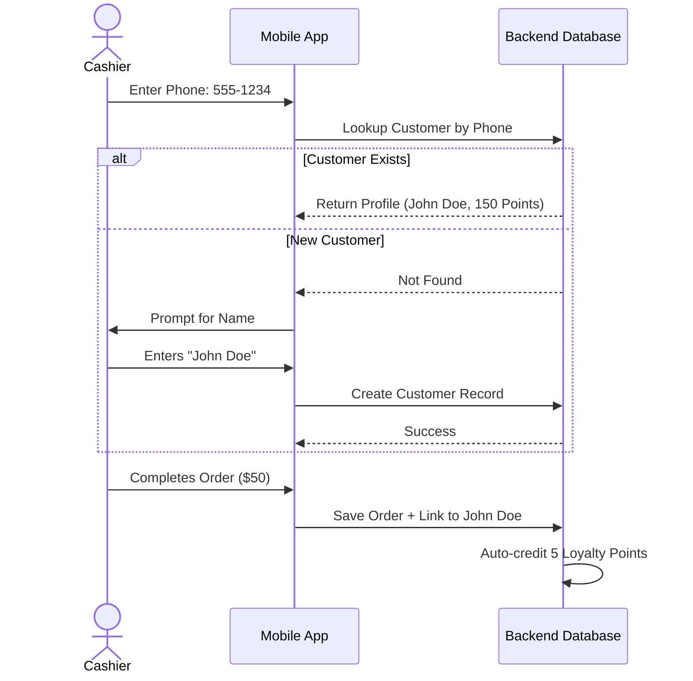

# CRM & Loyalty

## 1. Overview
The Customer Relationship Management (CRM) module helps businesses build long-term relationships with their patrons. It automatically captures customer data during checkout, tracks purchase history, and powers a points-based loyalty system to incentivize return visits.

## 2. Key Capabilities
* **Frictionless Capture:** Add a customer to an order simply by typing their phone number during billing. If they are new, they are automatically saved.
* **Rich Profiles:** View a customer's entire lifetime value, average order size, and specific favorite items.
* **Loyalty Points Engine:** Automatically award points based on order value (e.g., 1 point per $10 spent) which can be redeemed on future purchases.
* **Direct Communication (Future Scope):** Integration for bulk SMS or WhatsApp marketing campaigns based on customer segments (e.g., "Hasn't visited in 30 days").

## 3. How to Use

### A. Capturing a Customer during Billing
1. On the **Billing** screen, while items are in the cart, tap the **Customer** field.
2. Enter a phone number.
3. If the customer exists in your database, their name and current loyalty point balance will appear. 
4. If they are new, you will be prompted to enter their name.
5. Upon checkout, the order is permanently linked to this customer profile.

### B. Managing Customer Profiles
1. Navigate to the **CRM** tab on the bottom navigation bar.
2. View the list of all registered customers, sortable by total spend or point balance.
3. Tap a specific customer to open their detailed profile.
4. Here you can view their past orders, edit their contact information, or manually adjust their loyalty points.

### C. Redeeming Points
1. When a returning customer is attached to a new order, their available points are displayed on the checkout screen.
2. Tap **Redeem Points** to convert their points into a cash discount applied directly to the current bill.

## 4. Under the Hood (Data Flow)

