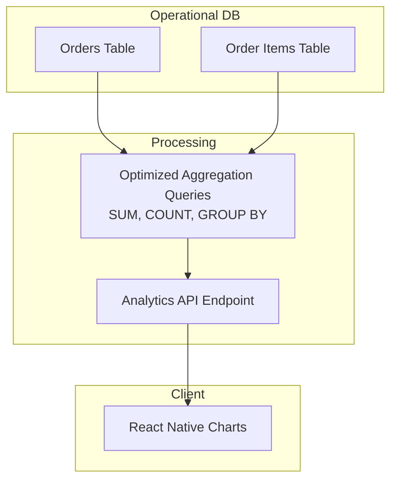

# Analytics & Reporting

## 1. Overview
The Analytics module transforms raw transaction data into actionable business intelligence. It provides owners and managers with a high-level overview of business health, as well as granular reports necessary for accounting and optimization.

## 2. Key Capabilities
* **Real-Time Dashboards:** Instantly view today's total sales, order volume, and average order value.
* **Best Sellers Identification:** Automatically ranks products by sales volume and revenue generated.
* **Trend Analysis:** Visual charts comparing sales across different days, weeks, or months to identify peak operational hours.
* **Exportable Reports:** Generate detailed CSV/PDF reports for tax compliance, staff shifts, and inventory wastage.

## 3. How to Use

### A. The Daily Snapshot
1. Navigate to the **Analytics** tab on the bottom navigation bar.
2. The default view shows "Today's Performance".
3. You will see summary cards for **Gross Revenue**, **Total Orders**, and **Active Tables** (if applicable).
4. A pie chart breaks down revenue by payment method (Cash vs Card vs UPI).

### B. Analyzing Product Performance
1. Scroll down on the Analytics dashboard to the **Top Items** section.
2. The list displays the most frequently sold items for the selected time period.
3. This data helps you make informed purchasing decisions and adjust menu/catalog pricing.

### C. Deep Dive Reports (Future Scope)
1. Tap the **Generate Report** button (often found in the top right).
2. Select the report type: *Sales Summary*, *Tax/GST Ledger*, or *Staff Performance*.
3. Choose a custom date range.
4. The system will compile the data and offer a download link or an option to email the report directly to an accountant.

## 4. Under the Hood (Data Flow)

Analytics queries can be resource-intensive. To prevent slowing down the main POS operations, complex aggregations are handled via optimized SQL views or processed asynchronously.

