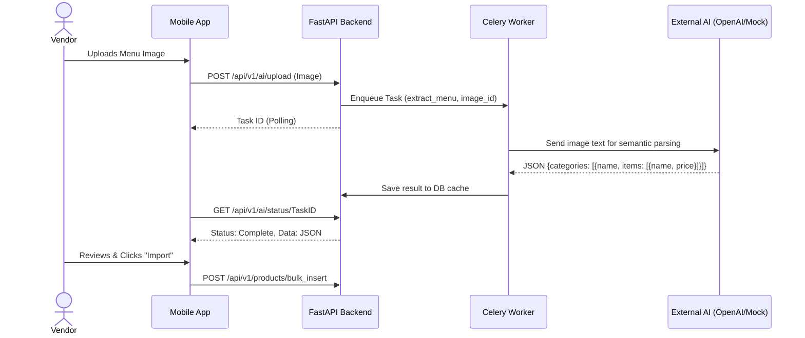

# AI Menu Generator

## 1. Overview
Onboarding a new restaurant or retail store onto a POS system is traditionally a grueling process requiring hours of manual data entry to create the product catalog. Tallyko solves this friction point using AI. The AI Menu Generator allows a vendor to upload a photo or PDF of their physical menu, and the system automatically extracts categories, item names, descriptions, and prices to build the digital catalog instantly.

## 2. Key Capabilities
* **Optical Character Recognition (OCR):** Extracts raw text from images or PDF documents.
* **Semantic Parsing:** Uses Large Language Models (LLMs) to understand the structure of the text (e.g., recognizing that "Starters" is a category, and "Garlic Bread - $5" is an item and a price).
* **Draft Review:** Presents the generated catalog as a draft, allowing the vendor to make quick edits before committing the items to the live database.

## 3. How to Use

### A. Uploading the Source Material
1. Navigate to the **AI Menu** tab on the bottom navigation bar.
2. Tap **Upload Menu/Catalog**.
3. Choose a PDF file or snap a picture of your physical menu using the device camera.
4. Tap **Generate Catalog**. 

### B. The Generation Process
1. A loading screen appears. Behind the scenes, the file is sent to the backend, processed via OCR, and analyzed by the AI model.
2. This process may take a few moments depending on the size of the menu.

### C. Review and Import
1. Once processing is complete, a categorized list of extracted items is displayed.
2. Review the list. You can tap any item to fix typos, adjust prices, or delete items the AI misinterpreted.
3. Once satisfied, tap **Import to Catalog**.
4. The items are immediately saved to your database and are instantly available for billing on the POS.

## 4. Under the Hood (Data Flow)

Because AI generation can take 10-30 seconds, it is highly recommended to offload this processing to a background worker to prevent the API from timing out or blocking other operations.

