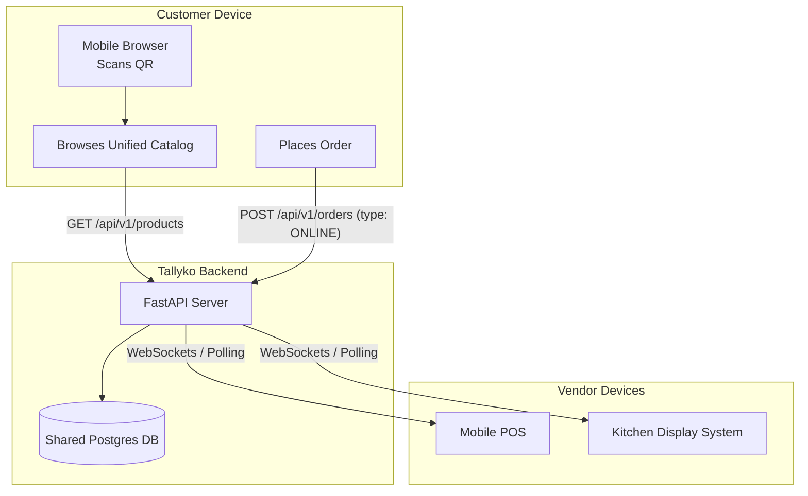

# Online Store & QR Menus

## 1. Overview
In the modern commerce era, an omnichannel presence is essential. Tallyko automatically provisions a public-facing online storefront for every registered tenant. For restaurants, this acts as a QR-code digital menu for dine-in ordering, or a delivery portal. For retail stores, it functions as an e-commerce storefront. Best of all, it shares the exact same database as the POS, meaning inventory and catalog updates sync instantly.

## 2. Key Capabilities
* **Zero-Setup Storefront:** The store is generated automatically the moment a vendor creates an account.
* **Unified Inventory:** An item sold online immediately deducts from the POS inventory. An item marked "Out of Stock" on the POS instantly disappears from the online store.
* **QR Code Ordering:** Restaurants can print QR codes placed on physical tables. When scanned, customers can view the menu, select items, and place orders directly to the Kitchen (KDS).
* **Commission-Free:** Unlike food delivery aggregators, orders placed through the Tallyko store are completely commission-free for the vendor.

## 3. How to Use

### A. Accessing the Store Link
1. From the POS dashboard, tap the **Store** tab on the bottom navigation bar.
2. The screen displays the unique URL for your business (e.g., `tallyko.com/store/your-business-name`).
3. You will also see a button to generate and print a QR code linking to this URL.

### B. The Customer Experience (QR Menu / Dine-in)
1. A customer sits at Table 5 and scans the QR code on the table.
2. Their smartphone browser opens the store link, pre-configured with `table_id=5`.
3. They browse the catalog, add a Burger and Fries to their cart, and tap **Place Order**.
4. The POS app immediately receives a push notification for a new order.
5. The kitchen's KDS tablet instantly receives a new ticket labeled "Table 5".

### C. Managing Online Orders
1. Online orders appear seamlessly within the main POS workflow.
2. In the **Tables** or **Kitchen** views, these orders are processed exactly like orders punched in manually by a waiter.
3. Once fulfilled, the order is settled via the standard billing checkout process.

## 4. Under the Hood (Data Flow)

The Online Store is typically a lightweight React/Next.js web application that communicates with the same FastAPI backend as the mobile POS.

